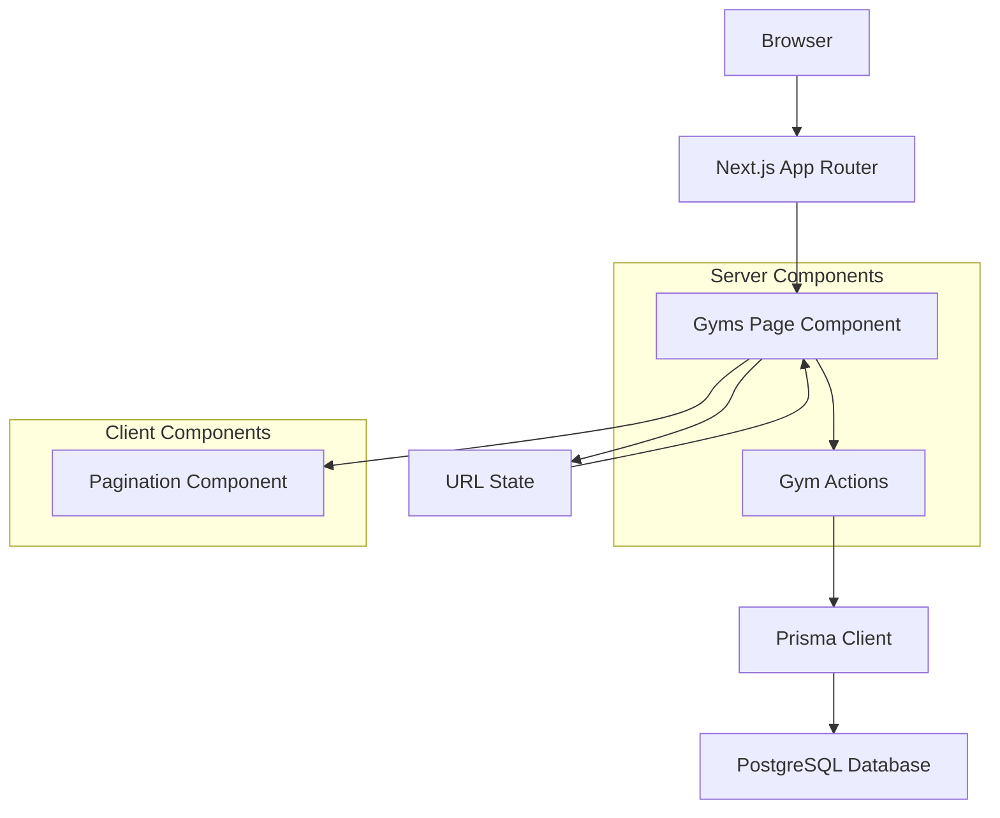

# Design Document: Gyms List Pagination

## Overview

This design document outlines the technical implementation for adding pagination to the gyms list page in FlexManagePro. The current implementation loads all gym records at once, which creates performance issues as the gym count grows. This feature introduces server-side pagination with a page size of 10 gyms per page, complete with navigation controls and URL state management.

The solution follows Next.js 16+ App Router patterns with React Server Components for optimal performance, leveraging Prisma for efficient database queries and maintaining the existing UI design system.

## Architecture

### High-Level Architecture



### Data Flow

1. **Initial Load**: User navigates to `/dashboard/gyms` or `/dashboard/gyms?page=N`
2. **URL Parsing**: Server component extracts page parameter from searchParams
3. **Data Fetching**: Server action queries database with LIMIT/OFFSET
4. **Rendering**: Server component renders gym table with paginated data
5. **Client Interaction**: Pagination component handles navigation events
6. **State Update**: URL updates trigger server re-render with new data

### Technology Stack Integration

- **Next.js 16+**: App Router with React Server Components
- **Prisma**: Database ORM with PostgreSQL adapter
- **TypeScript**: Type safety across all components
- **Tailwind CSS**: Consistent styling with existing design system
- **Radix UI**: Accessible UI components (Button, Table)

## Components and Interfaces

### 1. Enhanced Gyms Page Component

**File**: `app/dashboard/gyms/page.tsx`

```typescript
interface GymsPageProps {
  searchParams: Promise<{ page?: string }>
}

interface PaginatedGymsResponse {
  gyms: GymWithDetails[]
  pagination: {
    currentPage: number
    totalPages: number
    totalCount: number
    pageSize: number
  }
}

interface GymWithDetails {
  id: string
  gymName: string
  location: string
  createdAt: Date
  users: Array<{
    email: string
    role: Role
  }>
  _count: {
    users: number
  }
}
```

### 2. Pagination Component

**File**: `components/ui/pagination.tsx`

```typescript
interface PaginationProps {
  currentPage: number
  totalPages: number
  baseUrl: string
  className?: string
}

interface PaginationButtonProps {
  href: string
  disabled?: boolean
  children: React.ReactNode
  variant?: 'default' | 'outline'
}
```

### 3. Enhanced Gym Actions

**File**: `app/actions/gyms.ts`

```typescript
interface GetPaginatedGymsParams {
  page?: number
  pageSize?: number
}

interface PaginationMetadata {
  currentPage: number
  totalPages: number
  totalCount: number
  pageSize: number
  hasNextPage: boolean
  hasPreviousPage: boolean
}
```

## Data Models

### Database Schema (Existing)

The existing `GymProfile` model supports the pagination requirements:

```prisma
model GymProfile {
  id          String   @id @default(cuid())
  gymName     String
  location    String
  facilities  String[]
  adminSecret String   @default("flex-secret")
  users       User[]
  createdAt   DateTime @default(now())
  updatedAt   DateTime? @updatedAt
}
```

### Query Optimization

**Indexes Required**:
- `createdAt DESC` index for efficient ordering
- Composite index on `(createdAt, id)` for consistent pagination

**Prisma Query Pattern**:
```typescript
const gyms = await prisma.gymProfile.findMany({
  skip: (page - 1) * pageSize,
  take: pageSize,
  include: {
    users: {
      select: { email: true, role: true }
    },
    _count: { select: { users: true } }
  },
  orderBy: { createdAt: 'desc' }
})
```

## Error Handling

### Input Validation

1. **Invalid Page Parameter**:
   - Non-numeric values → Default to page 1
   - Negative numbers → Default to page 1
   - Zero → Default to page 1

2. **Out of Range Pages**:
   - Page exceeds total pages → Redirect to page 1
   - Empty result set → Show appropriate message

### Error Recovery Patterns

```typescript
// Page parameter validation
function validatePageParam(pageParam: string | undefined): number {
  if (!pageParam) return 1
  
  const page = parseInt(pageParam, 10)
  if (isNaN(page) || page < 1) return 1
  
  return page
}

// Database error handling
async function getPaginatedGymsWithFallback(params: GetPaginatedGymsParams) {
  try {
    return await getPaginatedGyms(params)
  } catch (error) {
    console.error('Failed to fetch paginated gyms:', error)
    return {
      gyms: [],
      pagination: {
        currentPage: 1,
        totalPages: 0,
        totalCount: 0,
        pageSize: 10
      }
    }
  }
}
```

### User Experience Error States

1. **Loading State**: Skeleton loaders during navigation
2. **Empty State**: "No gyms found" message with call-to-action
3. **Error State**: Retry button with error message
4. **Network Error**: Offline indicator with retry mechanism

## Correctness Properties

*A property is a characteristic or behavior that should hold true across all valid executions of a system-essentially, a formal statement about what the system should do. Properties serve as the bridge between human-readable specifications and machine-verifiable correctness guarantees.*

After analyzing the acceptance criteria, several properties are suitable for property-based testing while others are better suited for example-based or integration tests.

### Property Reflection

Before defining the final properties, I identified several areas of redundancy:
- Properties 6.2 and 6.3 (bookmarking and sharing URLs) test the same underlying behavior
- Properties 3.5 and 3.6 (navigation) can be combined into a single navigation property
- Properties 5.2 and 5.3 (display formatting) can be combined into a comprehensive display property

### Property 1: Valid Page Parameter Handling

*For any* valid positive integer page number within the available range, the system SHALL return the correct subset of gym records with accurate pagination metadata.

**Validates: Requirements 1.2, 2.1, 2.2**

### Property 2: Consistent Record Ordering

*For any* page number and dataset, gym records SHALL always be ordered by creation date in descending order (newest first) across all pages.

**Validates: Requirements 1.3**

### Property 3: Offset Calculation Accuracy

*For any* valid page number and page size, the backend API SHALL calculate the offset as (page - 1) × pageSize and return exactly the records for that range.

**Validates: Requirements 2.1, 7.1**

### Property 4: Complete Record Structure

*For any* gym record returned in paginated results, the record SHALL contain gym name, location, admin email, and member count with proper formatting and data integrity.

**Validates: Requirements 2.4, 5.1, 5.2, 5.3, 5.4, 5.5**

### Property 5: Invalid Input Normalization

*For any* invalid page parameter (non-numeric, negative, zero, or non-integer), the system SHALL default to page 1 and display the first page of results.

**Validates: Requirements 4.1**

### Property 6: Pagination Control State

*For any* valid page state, the pagination controls SHALL display the correct format "Page X of Y" and enable/disable navigation buttons appropriately based on current position.

**Validates: Requirements 3.4, 3.2, 3.3**

### Property 7: Navigation Consistency

*For any* valid page transition (previous/next), the system SHALL update the URL parameter correctly and navigate to the adjacent page while maintaining all other state.

**Validates: Requirements 3.5, 3.6**

### Property 8: URL State Preservation

*For any* valid page URL with query parameters, accessing that URL directly SHALL load the exact same page state and gym records as navigating to it through the interface.

**Validates: Requirements 6.1, 6.2, 6.3**

### Property 9: Member Count Calculation

*For any* gym record, the member count SHALL only include users with MEMBER role, excluding all users with ADMIN, TRAINER, or SUPER_ADMIN roles.

**Validates: Requirements 5.5**

### Property 10: Pagination Metadata Accuracy

*For any* paginated response, the metadata SHALL accurately reflect the total count, current page, total pages, and page size, with mathematical consistency between these values.

**Validates: Requirements 2.2**

## Testing Strategy

### Dual Testing Approach

This feature requires both property-based testing for universal behaviors and example-based testing for specific scenarios:

**Property-Based Tests**: Universal properties that hold across all valid inputs (Properties 1-10 above)
- Minimum 100 iterations per property test
- Each test tagged with: **Feature: gyms-list-pagination, Property {number}: {property_text}**
- Use fast-check library for TypeScript property-based testing

**Example-Based Tests**: Specific scenarios and edge cases
- Default page loading (Requirement 1.1)
- Empty state handling (Requirement 4.4)
- Error state handling (Requirement 4.3)
- UI component presence (Requirement 3.1)

**Integration Tests**: External dependencies and performance
- Database query optimization (Requirement 7.2)
- Performance benchmarks (Requirement 7.3)
- End-to-end pagination workflows

### Unit Testing Approach

**Core Functions to Test**:
- Page parameter validation logic
- Pagination metadata calculation
- Database query construction
- URL generation for navigation

**Testing Framework**: Jest with React Testing Library

**Example Test Cases**:
```typescript
describe('validatePageParam', () => {
  it('should return 1 for undefined input', () => {
    expect(validatePageParam(undefined)).toBe(1)
  })
  
  it('should return 1 for invalid string input', () => {
    expect(validatePageParam('abc')).toBe(1)
  })
  
  it('should return parsed number for valid input', () => {
    expect(validatePageParam('5')).toBe(5)
  })
})

describe('calculatePaginationMetadata', () => {
  it('should calculate correct metadata for middle page', () => {
    const result = calculatePaginationMetadata(25, 3, 10)
    expect(result).toEqual({
      currentPage: 3,
      totalPages: 3,
      totalCount: 25,
      pageSize: 10,
      hasNextPage: false,
      hasPreviousPage: true
    })
  })
})
```

### Integration Testing

**Database Integration**:
- Test pagination queries with various data sets
- Verify correct LIMIT/OFFSET calculations
- Test performance with large datasets

**Component Integration**:
- Test server component rendering with different page states
- Verify URL parameter handling
- Test navigation between pages

### Performance Testing

**Metrics to Monitor**:
- Database query execution time
- Page load time for different page sizes
- Memory usage during navigation

**Performance Targets**:
- Database queries: < 100ms for typical datasets
- Page rendering: < 2 seconds on 3G networks
- Navigation: < 500ms between pages

## Implementation Plan

### Phase 1: Backend Infrastructure
1. Create enhanced gym actions with pagination support
2. Implement input validation and error handling
3. Add database query optimization
4. Create TypeScript interfaces

### Phase 2: Frontend Components
1. Build reusable Pagination component
2. Update Gyms page component for server-side rendering
3. Implement URL state management
4. Add loading and error states

### Phase 3: Integration & Testing
1. Integration testing with database
2. Performance optimization
3. Error handling validation
4. User acceptance testing

### Phase 4: Deployment & Monitoring
1. Database index creation
2. Performance monitoring setup
3. Error tracking implementation
4. User feedback collection

## Performance Considerations

### Database Optimization

1. **Efficient Queries**:
   - Use `skip` and `take` for pagination
   - Minimize data transfer with selective `include`
   - Leverage database indexes for sorting

2. **Connection Management**:
   - Prisma connection pooling
   - Query timeout configuration
   - Connection retry logic

### Frontend Optimization

1. **Server Components**:
   - Leverage React Server Components for data fetching
   - Minimize client-side JavaScript
   - Efficient HTML streaming

2. **Caching Strategy**:
   - Next.js automatic caching for static content
   - Consider implementing page-level caching for gym data
   - Browser navigation caching

### Scalability Considerations

1. **Large Datasets**:
   - Cursor-based pagination for very large datasets (future enhancement)
   - Database partitioning strategies
   - Read replica considerations

2. **Concurrent Users**:
   - Database connection pooling
   - Rate limiting for API endpoints
   - Monitoring and alerting

## Security Considerations

### Input Validation

1. **URL Parameters**:
   - Sanitize page parameter input
   - Prevent SQL injection through parameterized queries
   - Rate limiting on pagination requests

2. **Access Control**:
   - Maintain existing role-based access control
   - Ensure pagination doesn't expose unauthorized data
   - Audit logging for data access

### Data Privacy

1. **Information Disclosure**:
   - Limit exposed gym information
   - Maintain existing data filtering
   - Secure admin email display

## Monitoring and Analytics

### Key Metrics

1. **Performance Metrics**:
   - Average page load time
   - Database query performance
   - Error rates by page

2. **Usage Analytics**:
   - Most accessed pages
   - Navigation patterns
   - User engagement with pagination

### Alerting

1. **Error Monitoring**:
   - Database connection failures
   - High error rates
   - Performance degradation

2. **Business Metrics**:
   - Unusual pagination patterns
   - Data inconsistencies
   - User experience issues

## Future Enhancements

### Short-term Improvements

1. **Enhanced Filtering**:
   - Search functionality within paginated results
   - Filter by gym status or location
   - Sort options (name, location, member count)

2. **User Experience**:
   - Keyboard navigation support
   - Infinite scroll option
   - Customizable page sizes

### Long-term Considerations

1. **Advanced Pagination**:
   - Cursor-based pagination for better performance
   - Virtual scrolling for large datasets
   - Real-time updates with WebSocket integration

2. **Analytics Integration**:
   - User behavior tracking
   - Performance analytics dashboard
   - A/B testing framework for pagination UX

## Conclusion

This design provides a robust, scalable solution for gym list pagination that maintains the existing user experience while significantly improving performance. The implementation leverages Next.js 16+ features, follows React best practices, and ensures type safety throughout the application.

The modular design allows for future enhancements while maintaining backward compatibility and providing a solid foundation for handling growing datasets efficiently.